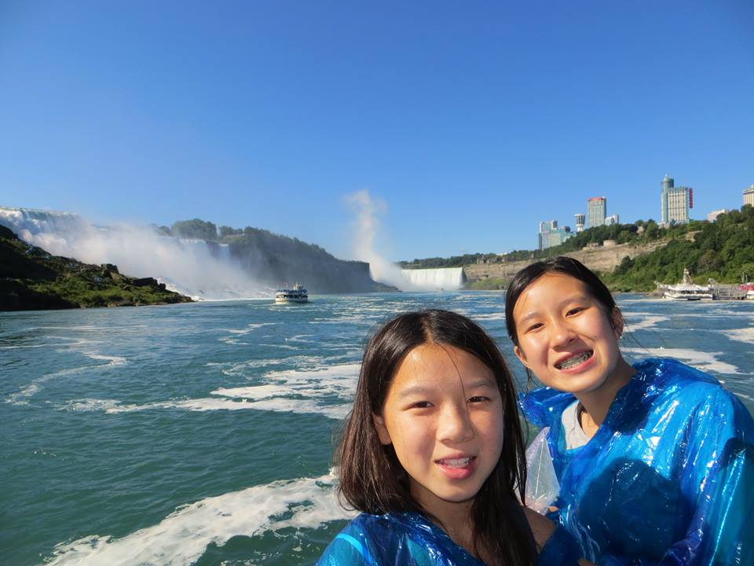
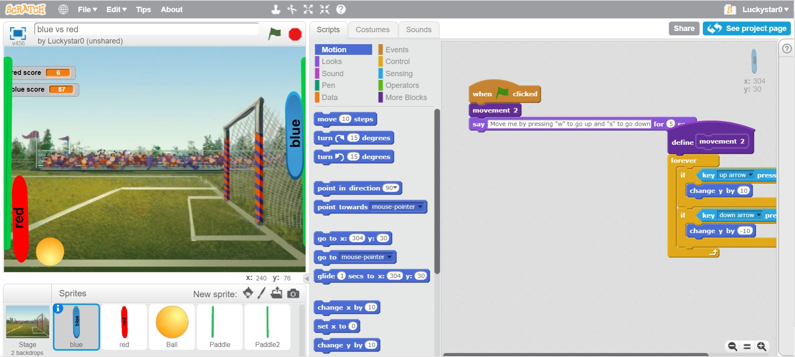
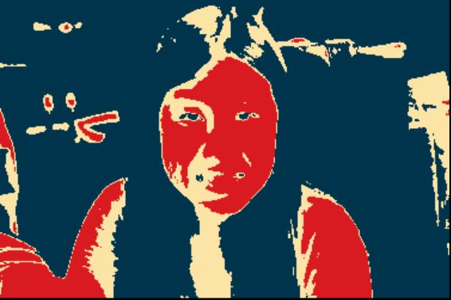
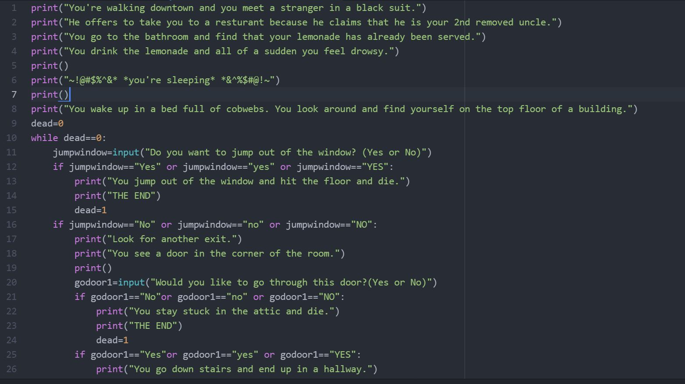

<!DOCTYPE html>
<html>
    <head>

    <!-- Required meta tags -->
    <meta charset="utf-8">
    <meta name="viewport" content="width=device-width, initial-scale=1, shrink-to-fit=no">

      <!-- Latest compiled and minified CSS -->
      <link rel="stylesheet" href="https://maxcdn.bootstrapcdn.com/bootstrap/3.3.7/css/bootstrap.min.css" integrity="sha384-BVYiiSIFeK1dGmJRAkycuHAHRg32OmUcww7on3RYdg4Va+PmSTsz/K68vbdEjh4u" crossorigin="anonymous">

      <!-- Optional theme -->
      <link rel="stylesheet" href="https://maxcdn.bootstrapcdn.com/bootstrap/3.3.7/css/bootstrap-theme.min.css" integrity="sha384-rHyoN1iRsVXV4nD0JutlnGaslCJuC7uwjduW9SVrLvRYooPp2bWYgmgJQIXwl/Sp" crossorigin="anonymous">

      <!-- Latest compiled and minified JavaScript -->
      

    <!-- jQuery library -->
    

      <!-- Bootstrap -->
      <link href="style.css" rel="stylesheet">

      <title>About Me!</title>

      <link rel="stylesheet" href="https://maxcdn.bootstrapcdn.com/bootstrap/4.0.0-alpha.6/css/bootstrap.min.css" integrity="sha384-rwoIResjU2yc3z8GV/NPeZWAv56rSmLldC3R/AZzGRnGxQQKnKkoFVhFQhNUwEyJ" crossorigin="anonymous">
      <link href="https://fonts.googleapis.com/css?family=Chewy|Comfortaa|Pacifico|Shadows+Into+Light+Two|Sigmar+One" rel="stylesheet">
      <link href="https://fonts.googleapis.com/css?family=Graduate" rel="stylesheet">
      <link href="https://fonts.googleapis.com/css?family=Acme" rel="stylesheet">
      <link href="https://fonts.googleapis.com/css?family=Acme" rel="stylesheet">
      <link href="https://fonts.googleapis.com/css?family=Boogaloo" rel="stylesheet">
      <link href="https://fonts.googleapis.com/css?family=Amatic+SC" rel="stylesheet">
      <link href="https://fonts.googleapis.com/css?family=Sigmar+One" rel="stylesheet">
    </head>

    <body style = "background:#a8fff1">

      

        

          <h1 style= "color:black; font-family: 'Amatic SC', cursive; font-size:100px">
Hi
</h1>
        

      

<!-- the top header and name  -->
        
        

          <h1 style= "color:5cc9bc; font-family: 'Graduate', cursive; font-size:50px">
Lauren Ng
</h1>
          <h2 style="color:#2eb9c9; font-family: 'Shadows Into Light Two', cursive; font-size:35px">
A moderately stressed High School Student
</h2>
          
 Hi, I'm Lauren, if you didn't see the title of the page.
            I'm currently a Senior at Sacred Heart Cathedral Prep. If you want to hire me, I'm a great candidate. I love working on projects,
            both big and small. 

          

<!-- the 3 purple squares -->
        

          
<h>
About Me
</h>
            
 I'm an adventurous teen who loves food and seeing new things. But I often get lost and confused. I also love tech and doing projects.
           I am also pretty stressed b/c of college and college apps. KILL ME
            

          

          
<h>
Achievements
</h>
              
What are achievements?
             

         

         
<h>
Dislikes
</h>
             

             <li> School
             <li> socializing
             <li> getting out of the house
             <li> waking up
             <li> working 

        

      

     

    

      
<h>
History
</h>
         
 I was born on Feburary 12, 2000 to my parents: Laraine Woo and Kevin Ng. Ever since then, I've been destroying the earth. When I was 3, I started
           preschool at Little Star Preschool. I graduated with honors. Then moved onto West Portal Lutheran for elementary and middle school. It was the best
           years of my life. Then I went to Sacred Heart Cathedral Prep. And my story ends here.
         

      

      
<h>
Fun Facts
</h>
          

          <li> I've been to 20+ states and 8 countries
          <li> I love outdoor sports, which includes skiing and backpacking
          <li> I would rather spend all my money on experiences instead of investing the money
          <li> My favorite food is California rolls with extra avacado on top
          

      

      
<h>
Likes
</h>
        

        <li> FOOD
        <li> traveling
        <li> life
        <li> YOUTUBE
        <li> NETFLIX!
        

      

    

    
<h>
Scratch
</h>
      
      
 This is the side-scroller game where it's like ping pong. There's nothing special
        because I had no clue what i was doing back then but now im smarter and better.

    

    
<h>
Obamicon
</h>
      
      
 Obamicon was a tough project. But pretty cool to see the end result. This was
      done on python and displays an image afterwards. I had a really hard time figuring
      out how to start the project but I managed to finish it with the help of Aarthi:)

    

    
<h>
Text Adventure
</h>
      
      
 This text adventure game is called Escape the Haunted Mansion. This game challenges the player
      to escape the haunted mansion by answer questions. It may take a couple of tries, but it's satifying
      when you finish the game!

    

    
<h>
Robotics
</h>
      
      
 Robotics is sooo cool. We worked with arduinos and little robots. 

    

    
<h>
Food!
</h>
    <!--slide show :)-->
    
    
    
    

  

    

      
    

    

      
    

    

      
    

    

      
    

    

      
    

    

      
    

    

      
    

    

      
    

  

  <a class="carousel-control-prev" href="#carouselExampleControls" role="button" data-slide="prev">
    
    Previous
  </a>
  <a class="carousel-control-next" href="#carouselExampleControls" role="button" data-slide="next">
    
    Next
  </a>

  </body>

  

</html>
